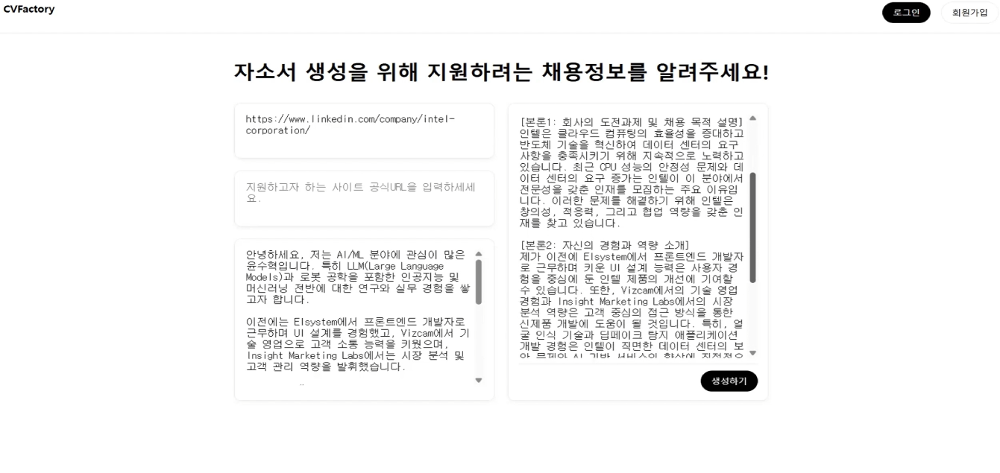

# 🧠 CVFactory – LLM 기반 자소서 자동 생성기

CVFactory는 사용자가 입력한 키워드와 경험을 바탕으로, LLM 기반 AI가 자기소개서를 자동 생성해주는 웹 애플리케이션입니다.  
입력한 정보를 바탕으로 자연스러운 문장을 구성하고, 미리보기/수정/저장 기능을 제공합니다.

---

## 📌 주요 기능
- 키워드 기반 자소서 자동 생성
- Django 기반 백엔드 구조
- 사용자 커뮤니티 기능 포함 (자기소개서 공유, 피드백)
- 향후 GPT 연동 및 템플릿 자동화 기능 확장 예정

---

## 🛠 사용 기술

| 구분 | 기술 |
|------|------|
| Backend | Python, Django |
| Frontend | HTML/CSS (Bootstrap) |
| AI Model | Llama-3 기반 Prompt Engineering |
| DB | SQLite (개발용) |
| 배포 | GitHub (버전관리), 이후 Render/Supabase 예정 |

---

## 🖼 프로젝트 구조

```
CVFactory/
├── Main_Server-main/
│   ├── api/
│   ├── crawlers/
│   ├── cvfactory/
│   └── data_management/
├── bulletin_board-main/
│   └── board/
├── 1분 시연 영상.mp4
├── CV_Factory 보고서.pdf
├── demo_screenshot_1.png
├── demo_screenshot_2.png
├── demo_screenshot_3.png
└── README.md
```

---

## 🚀 설치 및 실행 방법

### 1. 저장소 클론
```bash
git clone https://github.com/Moon-Yeehwan/CV_Factory.git
cd CV_Factory
```

### 2. 가상환경 설정 및 실행
```bash
python -m venv venv
source venv/bin/activate   # Windows: venv\Scripts\activate

pip install -r requirements.txt

cd Main_Server-main
python manage.py runserver
```

---

## ✨ 사용 예시

1. 메인 페이지에서 키워드를 입력  
   예시: `AI`, `데이터 분석`, `창의성`, `협업`

2. 버튼 클릭 시 → LLM 기반 자소서 자동 생성

---

## 🖥️ 데모 화면 예시

### 1. 키워드 입력 화면


---

### 2. 생성된 자소서 미리보기


---

### 3. 자소서 저장 및 공유 기능


---

## 🎥 시연 영상 & 발표자료

📽 [1분 시연 영상](./1분%20시연%20영상.mp4)  
📄 [CV_Factory 보고서](./CV_Factory%20보고서.pdf)
