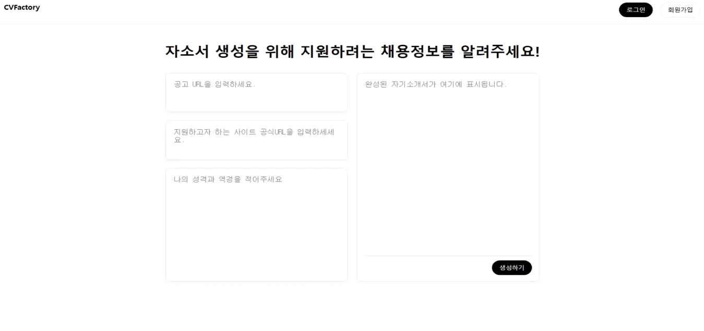

# CVFactory - 자소서 자동 생성기 ✨

AI 기반으로 자기소개서를 자동 생성하는 웹 애플리케이션입니다.  
Llama 기반 프롬프트를 활용하여 키워드 입력만으로 빠르게 자소서를 완성할 수 있습니다.

## 📌 주요 기능
- 키워드 기반 자소서 자동 생성
- Django 기반 백엔드 구조
- 사용자 커뮤니티 기능 포함 (자기소개서 공유, 피드백)
- 향후 GPT 연동 및 템플릿 자동화 기능 확장 예정

## 🛠 사용 기술

| 구분 | 기술 |
|------|------|
| Backend | Python, Django |
| Frontend | HTML/CSS (Bootstrap) |
| AI Model | Llama-3 기반 Prompt Engineering |
| DB | SQLite (개발용) |
| 배포 | GitHub (버전관리), 이후 Render/Supabase 예정 |

## 🖼 프로젝트 구조

CVFactory_project/
├── Main_Server-main/
│   ├── api/
│   ├── crawlers/
│   ├── cvfactory/
│   └── data_management/
├── bulletin_board-main/
│   └── board/

## 🚀 설치 및 실행 방법

### 1. 저장소 클론
```bash
git clone https://github.com/Moon-Yeehwan/CV_Factory.git
cd CV_Factory

python -m venv venv
source venv/bin/activate   # Windows: venv\Scripts\activate

pip install -r requirements.txt

cd Main_Server-main
python manage.py runserver

## ✨ 사용 예시

1. 메인 페이지에서 키워드를 입력  
   예시: `AI`, `데이터 분석`, `창의성`, `협업`

2. 버튼 클릭 시 → LLM 기반 자소서 자동 생성

3. 결과 예시:

CVFactory는 아래처럼 키워드 입력만으로 자소서를 자동 생성할 수 있습니다.

### 🔹 1. 입력 화면


### 🔹 2. 생성 중 화면


### 🔹 3. 생성 완료 결과


## 2. 시연 영상 및 보고서

### ▶️ 1분 시연 영상 보러가기

[](https://github.com/Moon-Yeehwan/CV_Factory/raw/main/1분%20시연%20영상.mp4)

> 🔗 위 이미지를 클릭하면 시연 영상(mp4)이 재생됩니다.

---

### 📄 CV_Factory 발표 보고서 (PDF)

[📄 PDF 다운로드](https://github.com/Moon-Yeehwan/CV_Factory/raw/main/CV_Factory%20보고서.pdf)


